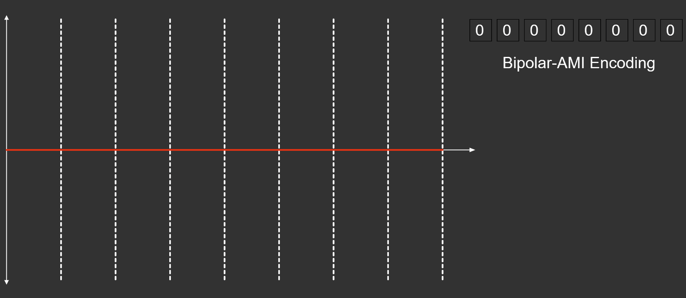
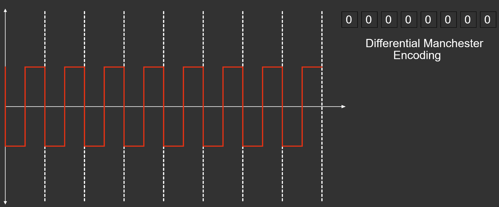
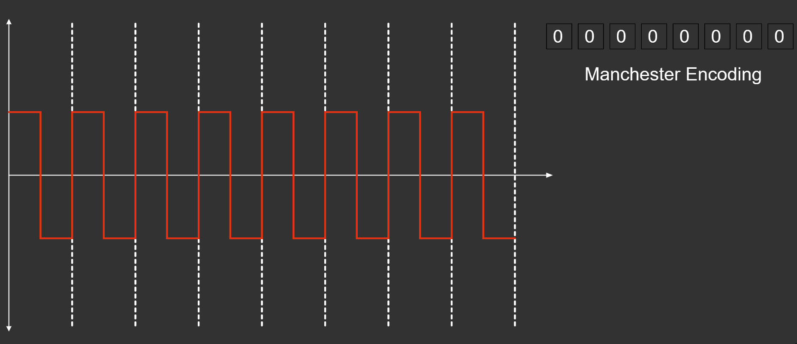
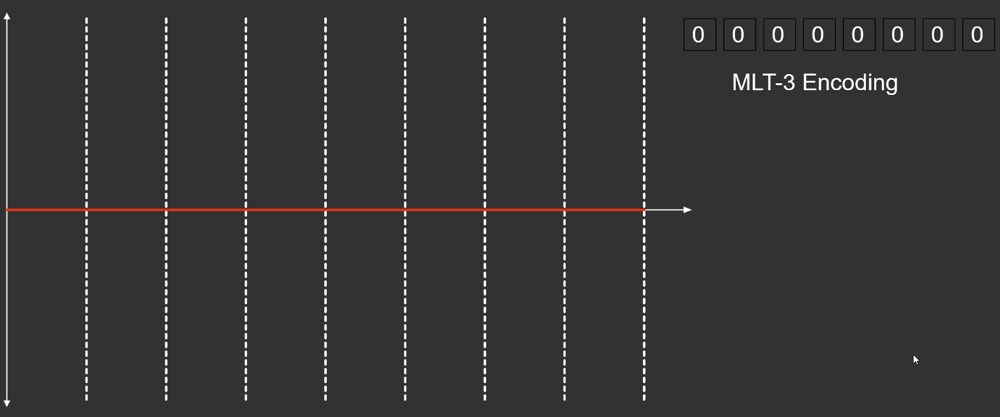
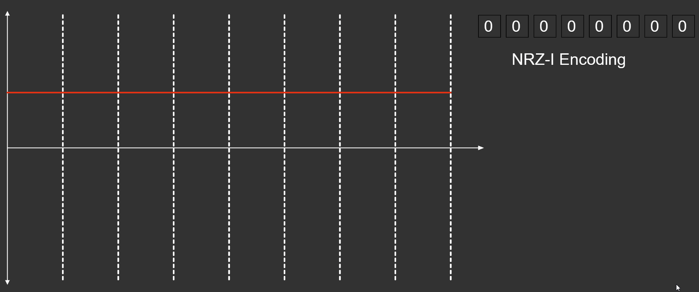
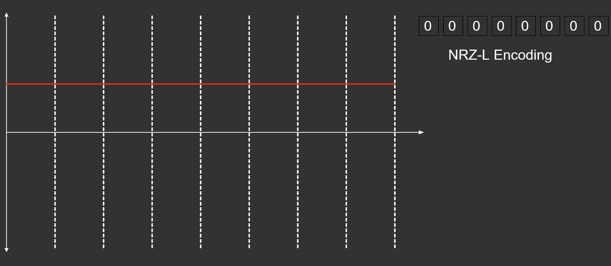
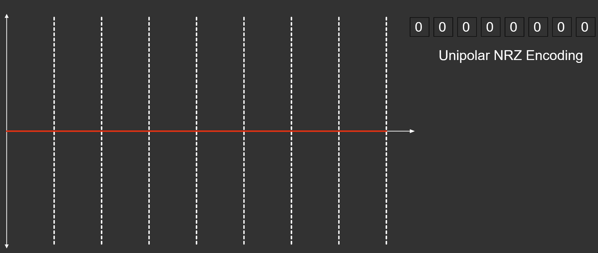

# Line Encoding 

```
`Line coding` is the process of converting digital data to digital signals. Line coding converts a sequence
of bits to a digital signal. At the sender, digital data are encoded into a digital signal; at the receiver, 
the digital data are recreated by decoding the digital signal.
```
>  

`Click to toggle the bit`

# Interactive Line Encoding Simulations 

* [Bipolar AMI line-coding](https://two-ticks.github.io/line-encoding/bipolar-ami-line-coding.html)
* [Diffrential Manchester line-coding](https://two-ticks.github.io/line-encoding/diffrential-manchester-line-coding.html)
* [Manchester line-coding](https://two-ticks.github.io/line-encoding/manchester-line-coding.html)
* [MLT-3 line-coding](https://two-ticks.github.io/line-encoding/mlt-3-line-coding.html)
* [NRZ-I line-coding](https://two-ticks.github.io/line-encoding/nrz-i-line-coding.html)
* [NRZ-L line-coding](https://two-ticks.github.io/line-encoding/nrz-l-line-coding.html)
* [Unipolar NRZ line-coding](https://two-ticks.github.io/line-encoding/unipolar-nrz-line-coding.html)

# Line Coding Requirements

* Small transmission bandwidth
* Power efficiency: as small as possible for required data rate and error
  probability
* Error detection/correction
* Suitable power spectral density, e.g., little low frequency content
* Timing information: clock must be extracted from data
* Transparency: all possible binary sequences can be transmitted

# Alternate Mark Inversion (Bipolar) Signaling

AMI encodes 0 as 0 V and 1 as +V or −V, with alternating signs.
AMI was used in early PCM systems.
* Eliminates DC build up on cable.
* Reduces bandwidth compared to polar.
* Provides error detecting; every bit error results in bipolar violation.
* Guarantees transitions for timing recovery with long runs of ones.

> 

# Differential Manchester Encoding

Differential Manchester Encoding, also called biphase mark code (BMC) or FM1, is a line code in which data and clock signals are combined to form a single 2-level self-synchronizing data stream. It is a differential encoding, using the presence or absence of transitions to indicate logical value. It has the following advantages over some other line codes:

* A transition is guaranteed at least once every bit, allowing the receiving device to perform clock recovery.
* Detecting transitions is often less error-prone than comparing against a threshold in a noisy environment.
* Unlike with Manchester encoding, only the presence of a transition is important, not the polarity. Differential coding schemes will work exactly the same if the signal is inverted (wires swapped). (Other line codes with this property include NRZI, bipolar encoding, coded mark inversion, and MLT-3 encoding).
* If the high and low signal levels have the same voltage with opposite polarity, coded signals have zero average DC voltage, thus reducing the necessary transmitting power and minimizing the amount of electromagnetic noise produced by the transmission line.
>

# Manchester Encoding

Manchester encoding is a synchronous clock encoding technique used by the physical layer of the Open System Interconnection [OSI] to encode the clock and data of a synchronous bit stream.
* A logic 0 is indicated by a 0 to 1 transition at the centre of the bit and logic 1 by 1 to 0 transition.
* The signal transitions do not always occur at the ‘bit boundary’ but there is always a transition at the centre of each bit.
* The Manchester Encoding is also called Biphase code as each bit is encoded by a positive 90 degrees phase transition or by negative 90 degress phase transiton..
* The Manchester Encoding consumes twice the bandwidth of the original signal.
* The advantages of Manchester code is that the DC component of the signal carries no information. This makes it possible that standards that usually do not carry power can transmit this information.
>

# MLT-3 Encoding 

MLT-3 encoding is a line coding scheme used in a telecommunication system for transmission purposes that uses three voltage levels. MLT-3 cycles sequentially through the voltage levels −1, 0, +1, 0. It moves to the next state to transmit a 1 bit, and stays in the same state to transmit a 0 bit. Similar to simple NRZ encoding, MLT-3 has a coding efficiency of 1 bit/baud, however it requires four transitions (baud) to complete a full cycle (from low-to-middle, middle-to-high, high-to-middle, middle-to-low). Thus, the maximum fundamental frequency is reduced to one fourth of the baud rate. This makes signal transmission more amenable to copper wires.

>

# NRZ–Inverted Encoding

If a 1 occurs at the incoming signal, then there occurs a transition at the beginning of the bit interval. For a 0 at the incoming signal, there is no transition at the beginning of the bit interval.

NRZ codes has a disadvantage that the synchronization of the transmitter clock with the receiver clock gets completely disturbed, when there is a string of 1s and 0s. Hence, a separate clock line needs to be provided.

>

# NRZ–Level Encoding

There is a change in the polarity of the signal, only when the incoming signal changes from 1 to 0 or from 0 to 1. It is the same as NRZ, however, the first bit of the input signal should have a change of polarity.

>

# Unipolar NRZ Encoding

It is unipolar line coding scheme in which positive voltage defines bit 1 and the zero voltage defines bit 0. Signal does not return to zero at the middle of the bit thus it is called NRZ.

>
